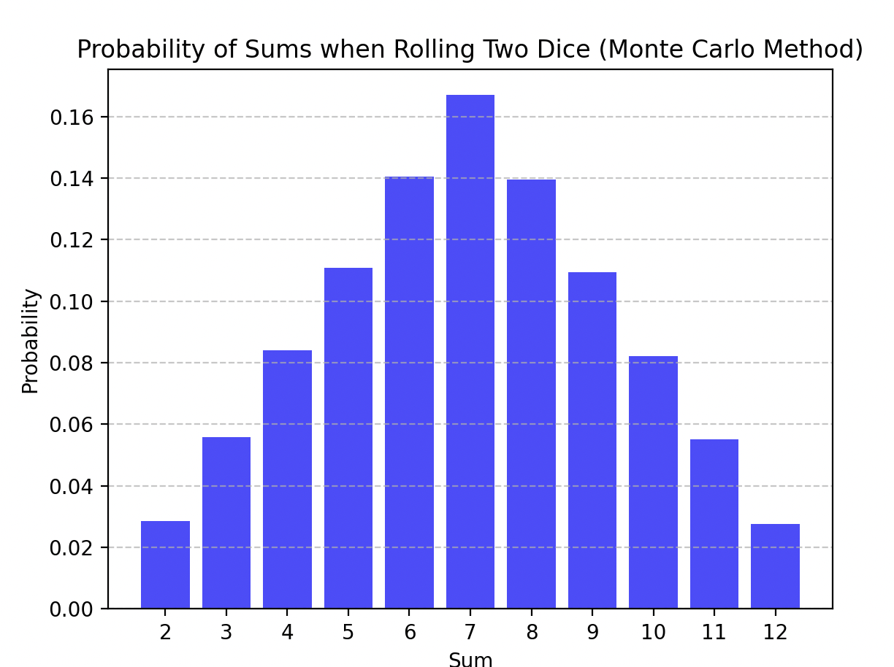

# Monte Carlo Simulation for Dice Rolls

## Task Overview

The task involved creating a Monte Carlo simulation to model the rolling of two dice, calculating the sums of the numbers that appear, and determining the probability of each possible sum.

## Approach

- Simulated the rolling of two dice using random number generation.
- Counted the occurrences of each possible sum (from 2 to 12).
- Calculated the probabilities by dividing the occurrences by the total number of rolls.
- Compared the simulation results with theoretical probabilities.

## Results

### Probability Table (Monte Carlo Simulation)

| Sum | Probability (Monte Carlo) |
| --- | ------------------------- |
| 2   | 2.85%                     |
| 3   | 5.57%                     |
| 4   | 8.39%                     |
| 5   | 11.07%                    |
| 6   | 14.05%                    |
| 7   | 16.69%                    |
| 8   | 13.95%                    |
| 9   | 10.94%                    |
| 10  | 8.20%                     |
| 11  | 5.51%                     |
| 12  | 2.77%                     |

### Theoretical Probability Table

| Sum | Probability (Theoretical) |
| --- | ------------------------- |
| 2   | 2.78%                     |
| 3   | 5.56%                     |
| 4   | 8.33%                     |
| 5   | 11.11%                    |
| 6   | 13.89%                    |
| 7   | 16.67%                    |
| 8   | 13.89%                    |
| 9   | 11.11%                    |
| 10  | 8.33%                     |
| 11  | 5.56%                     |
| 12  | 2.78%                     |

### Conclusion

The Monte Carlo simulation results closely match the theoretical probabilities, demonstrating the accuracy of the simulation. Minor discrepancies may occur due to the finite number of simulations, but with a large enough sample size (100,000 rolls in this case), the results should converge to the theoretical values.

### Visualization

